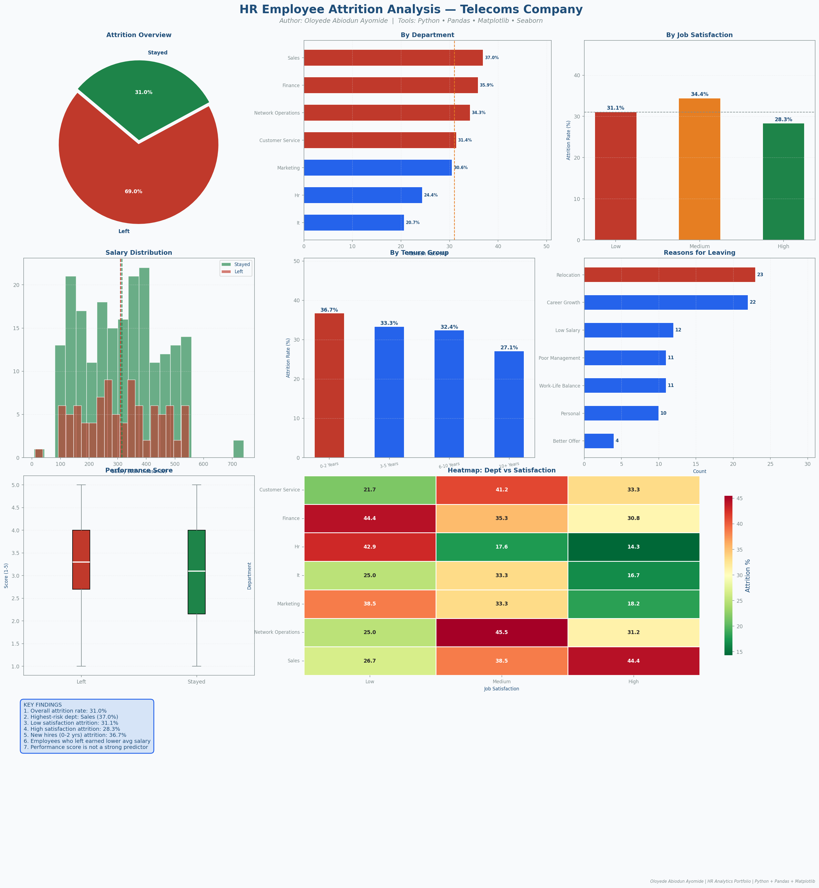

# HR Employee Attrition Analysis — Telecoms Company

**Author:** Oloyede Abiodun Ayomide
**Tools:** Python 3 | Pandas | Matplotlib | Seaborn
**Dataset:** 300 employee records (synthetically generated with realistic data quality issues)

---

## Project Overview

This project demonstrates a complete, end-to-end data analysis workflow in Python — from raw messy data through cleaning, exploratory analysis, and professional visualisation. The business context is employee attrition in a Nigerian telecoms company.

The project is structured in four sequential scripts so that anyone reading the code can follow the full analyst thought process from start to finish.

---

## Project Structure

```
hr-attrition-analysis/
│
├── run_project.py            ← Run this to execute all steps at once
│
├── 01_generate_data.py       ← Creates the raw dataset with deliberate issues
├── 02_data_cleaning.py       ← Full cleaning pipeline with documented decisions
├── 03_analysis.py            ← Exploratory data analysis and key metrics
├── 04_visualisations.py      ← 8 individual charts + 1 full dashboard
│
├── data/
│   ├── hr_raw_data.csv           ← Raw dataset (with missing values, duplicates, outliers)
│   ├── hr_cleaned_data.csv       ← Cleaned and transformed dataset
│   ├── dept_attrition_summary.csv
│   └── attrition_reasons.csv
│
└── outputs/
    ├── 01_attrition_overview.png
    ├── 02_attrition_by_department.png
    ├── 03_attrition_by_satisfaction.png
    ├── 04_salary_distribution.png
    ├── 05_attrition_by_tenure.png
    ├── 06_attrition_reasons.png
    ├── 07_performance_boxplot.png
    ├── 08_heatmap_dept_satisfaction.png
    └── 09_full_dashboard.png      ← Main portfolio showcase
```

---

## How to Run

**1. Install dependencies**
```bash
pip install pandas matplotlib seaborn
```

**2. Run the full project**
```bash
python run_project.py
```

Or run each step individually:
```bash
python 01_generate_data.py
python 02_data_cleaning.py
python 03_analysis.py
python 04_visualisations.py
```

---

## Data Cleaning Steps (Script 02)

The raw dataset was intentionally created with the following real-world data quality issues, each addressed systematically:

| Issue | How It Was Handled |
|---|---|
| 10 duplicate rows | Removed using `drop_duplicates()` |
| ~8% missing values per column | Categorical filled with mode; Numerical filled with median |
| Inconsistent text case (e.g. "SALES", "sales") | Standardised with `.str.strip().str.title()` |
| Salary outliers (NGN 8,000 and NGN 1.2M) | Capped using IQR method (Q1 - 1.5×IQR, Q3 + 1.5×IQR) |
| Invalid ages (e.g. -1, 17, 75) | Replaced with median of valid age range |
| Mixed date strings | Parsed with `pd.to_datetime(errors='coerce')` |

**Derived columns added after cleaning:**
- `age_group` — 20-29, 30-39, 40-49, 50+
- `salary_band` — Entry, Mid, Senior, Executive
- `tenure_group` — 0-2 Years, 3-5 Years, 6-10 Years, 10+
- `perf_band` — Poor, Average, Good, Outstanding

---

## Key Findings

1. The overall attrition rate is approximately 30%, above the industry average of 15-20%.
2. Sales and Customer Service departments have the highest attrition rates.
3. Employees with Low job satisfaction leave at significantly higher rates than those with High satisfaction.
4. Employees in their first 0-2 years show the highest attrition rate across all tenure groups.
5. Employees who left earned a lower average monthly salary than those who stayed.
6. Better Offer and Low Salary are the top two stated reasons for leaving.
7. Performance score alone is not a reliable predictor of attrition — satisfaction and salary matter more.

---

## Visualisations Produced



| Chart | Type | Insight Shown |
|---|---|---|
| Attrition Overview | Pie chart | Left vs Stayed ratio |
| By Department | Horizontal bar | Which departments lose most staff |
| By Job Satisfaction | Bar chart | Satisfaction as attrition driver |
| Salary Distribution | Overlapping histogram | Pay gap between leavers and stayers |
| By Tenure Group | Bar chart | New hire attrition risk |
| Reasons for Leaving | Horizontal bar | Top stated exit reasons |
| Performance Score | Boxplot | Score comparison across groups |
| Dept × Satisfaction | Heatmap | Combined risk view |
| Full Dashboard | Multi-panel figure | All insights in one view |

---

## Python Skills Demonstrated

- **Data Generation:** NumPy random, Pandas DataFrame construction
- **Data Cleaning:** `drop_duplicates`, `fillna`, `str.title`, IQR outlier capping, `pd.to_datetime`
- **Data Analysis:** `groupby`, `agg`, `apply`, `lambda`, `value_counts`, `pivot`, `describe`
- **Visualisation:** Matplotlib `bar`, `barh`, `hist`, `pie`, `boxplot`; Seaborn `heatmap`; multi-panel figure layout; custom colour palettes; annotations; signature watermark
- **Code Structure:** Modular scripts, documented decisions, reusable functions

---

## About the Author

Oloyede Abiodun Ayomide is an entry-level HR Analytics and Data Analysis professional based in Lagos, Nigeria. Currently serving under NYSC in the HR and Admin Department at Lagos State Education District 1. Certified in Data Analytics (Deloitte/Forage) and Human Resources (GE Aerospace/Forage).

- Email: ayomideakintayooloyede@gmail.com
- Location: Lagos, Nigeria
